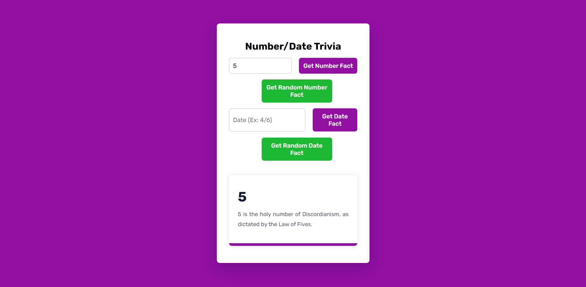

# Number Trivia App

Did you know that the number "56" is the number of layers of the Universe according to Aristotle, or that April 21st is the day in 1994 that the first discoveries of extrasolar planets were announced by Alexander Wolszczan? Well, now you do and you can learn more with this Number Trivia App written with vanilla HTML, CSS, and JavaScript. This web app uses the <a href="http://numbersapi.com/#42" target="_blank">Numbers API</a> to fetch trivia about numbers and dates and display it to the user. The user can either enter a number or a date and the app will fetch the trivia for that number or date. Pressing the "Get Random Number Fact" or "Get Random Date Fact" button will fetch a random number or date and display the trivia for that number or date. This web app can be viewed on mobile devices.

# Features

- **Numbers API**: This app uses the Numbers API to fetch trivia about numbers and dates.
- **Random Number Generation**: Random number generation is used to fetch random numbers and dates.
- **Mobile Responsiveness**: This app can be viewed on mobile devices.

## How to Run

1. Download the files from this repository.
2. Open the "index.html" file in your web browser.
3. Enter a number or date and press the "Get Number Fact" or "Get Date Fact" button to fetch the trivia for that number or date.
4. Press the "Get Random Number Fact" or "Get Random Date Fact" button to fetch a random number or date and display the trivia for that number or date.

## Credits

This project was inspired by the video tutorial <a href="https://youtu.be/RoGRFGbeIGk?si=nxFexEbTxEqzjIoI" target="_blank">Number Trivia App | Javascript Project |HTML, CSS & Javascript</a> by Coding Artist. Additional styling and date functionality was added independently.